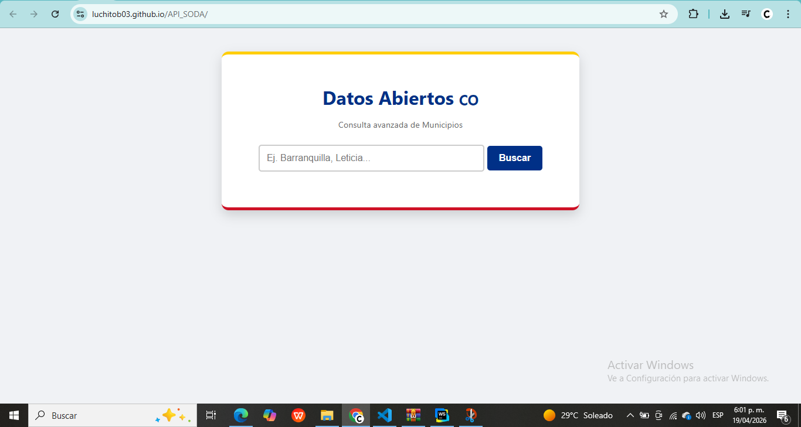
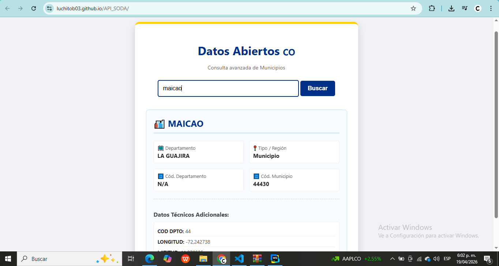
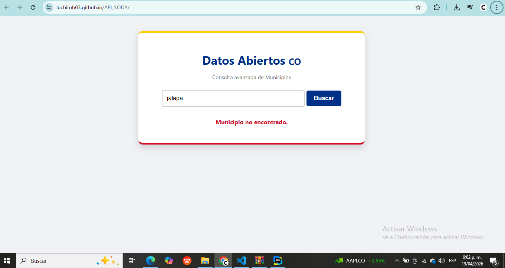

# Consulta de Datos Abiertos de Municipios — Colombia

Aplicación web desarrollada en HTML, CSS y JavaScript que permite consultar información de municipios de Colombia mediante el consumo de una API pública de datos abiertos.

El sistema realiza búsquedas dinámicas y presenta tanto información estructurada como datos adicionales obtenidos directamente de la respuesta de la API.

---

##  Descripción del sistema

La aplicación permite al usuario ingresar el nombre de un municipio y consultar información relevante como:

* Departamento
* Región o tipo de municipio
* Códigos administrativos
* Datos adicionales dinámicos

La información es obtenida en tiempo real desde la API de datos abiertos del gobierno colombiano.

---

##  Tecnologías utilizadas

* HTML5
* CSS3
* JavaScript
* Fetch API

---

##  API utilizada

* Portal de datos abiertos de Colombia: https://www.datos.gov.co

### Endpoint:

```id="m9dj21"
GET https://www.datos.gov.co/resource/gdxc-w37w.json?$q={municipio}&$limit=1
```

### Parámetros:

* `$q`: término de búsqueda (nombre del municipio)
* `$limit`: número de resultados (se limita a 1)

---

##  Flujo de funcionamiento

1. El usuario ingresa el nombre de un municipio
2. Se valida que el campo no esté vacío
3. Se construye dinámicamente la URL de consulta
4. Se realiza la petición HTTP mediante `fetch`
5. Se procesa la respuesta en formato JSON
6. Se renderizan los datos principales en una tarjeta
7. Se recorren dinámicamente las propiedades adicionales del objeto
8. Se muestran datos extra sin necesidad de estructura fija
9. Se manejan errores en caso de fallos o resultados vacíos

---

##  Estructura del proyecto

```id="j2kq91"
/proyecto
│── index.html
│── README.md
│── /images
│     └── evidencias
```

---

##  Funcionalidades principales

* Consumo de API REST con `fetch`
* Manejo de asincronía con `async/await`
* Renderizado dinámico del DOM
* Generación automática de listas a partir de objetos JSON
* Validación de entrada del usuario
* Manejo de errores en interfaz
* Búsqueda mediante botón y tecla Enter

---

##  Manejo de errores

El sistema contempla los siguientes escenarios:

* Campo de entrada vacío
* Error de conexión con la API
* Municipio no encontrado

Los errores se muestran directamente en la interfaz para mejorar la experiencia del usuario.

---

##  Procesamiento dinámico de datos

Una característica relevante del sistema es la iteración sobre todas las propiedades del objeto retornado por la API:

```id="n8wz0p"
for (const [clave, valor] of Object.entries(muni)) {
```

Esto permite:

* Adaptabilidad a cambios en la API
* Visualización de datos no estructurados
* Mayor flexibilidad en la presentación de información

---

## Evidencias

Capturas del funcionamiento:

###  carga principal



###  Consulta exitosa maicao como ejemplo



###  Manejo de error



---


##  Autor

Desarrollado por Berti Luis y Herrera Camilo como práctica académica orientada al consumo de APIs públicas en este caso gov.co

---
